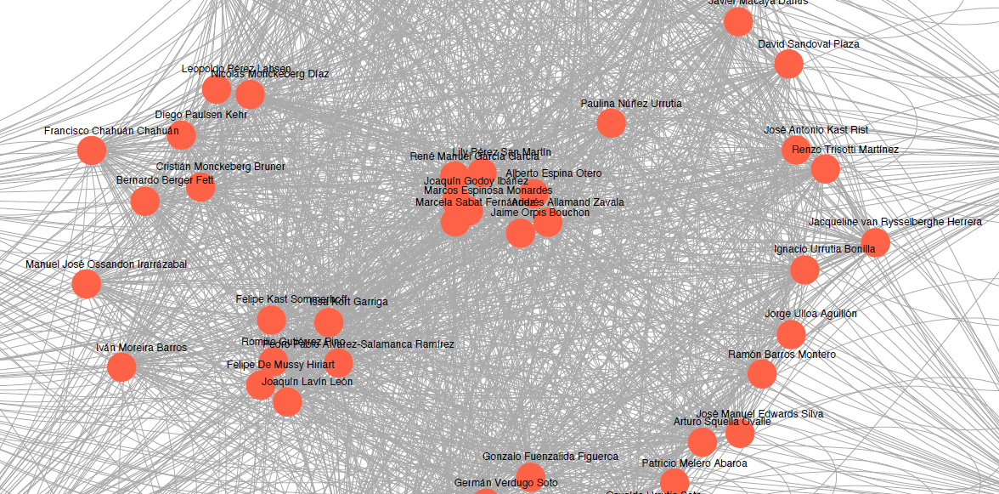

```{r Cargar paquetes y bases, message=FALSE, warning=FALSE, include=FALSE}
## Paquetes
pacman::p_load(tidyverse, rvest, stringr, rebus, lubridate, sjmisc, ggplot2, igraph)

## Bases
load("input/data/ScrapReq1972_2020.RData")
load("input/data/Req_per_2014.RData")
load( "input/data/Req_per_2020.RData")

# Cargar matriz
load("output/matrix.RData")

#Creación grafo base
g <- graph.adjacency(Matriz_sintesis, mode = "undirected",weighted = TRUE, diag= F)

#Ego Medidas
  
  #grados de nodos
  degree(g)[degree(g)>0]
  #Eigenvector centrality
  eigen_centrality(g)$vector
  #Betweenness
  betweenness(g)

#Medidas globales
  
  #Path length
  average.path.length(g)
  #diámetro: distancia entre los nodos más distantes
  diameter(g)
  #densidad: razón entre número de ejes observado versus potencial
  graph.density(g)
  
#Identificación de clusters
  
  g_CL <- cluster_louvain(g) 
  #for (i in 1:101) {print(g_CL[i])}
  g_CL[4]
  g_CL[28]
  
  
stats <- data.frame(degree(g), betweenness(g), eigen_centrality(g)$vector)
colnames(stats) <- c("Degree", "Betweenness", "Eigen centrality")
stats
```

# **Introducción**
En un contexto de deslegitimación de la democracia liberal, elpresente estudio busca aportar con evidencia –mediante un análisis de redes sociales– sobre la instrumentalización de las instituciones democráticas chilenas, en este caso, el Tribunal Constitucional. Dicho contexto de crisis de la democracia liberal [@castells_ruptura_2017] interpela las formas en que se desarrolla la relación entre política y sociedad en el mundo occidental. Así, una hipótesis plausible argumenta que la crisis se debe a la instrumentalización de la institucionalidad democrática por ciertos grupos sociales para sus propios fines. De esta forma, la sociedad deslegitima la política al percibir dicha instrumentalización como injusta y, por tanto, antidemocrática. En ello juega un rol fundamental y específico la instrumentalización de la constitución política de un país, la cual permite frenar o subsumir cualquier cambio político y social a su marco normativo vigente, relegando la capacidad del sistema político a la voluntad de grupos sociales minoritarios.

La constitución política chilena de 1980 –de origen autoritario, pero cuyo objetivo es la transición democrática— representa uno de los casos paradigmáticos de instrumentalización. Si bien contempla una transición donde el propósito es cambiar el régimen autoritario de Pinochet por una democracia, contiene a su vez una impronta autoritaria que imprime en la correlación de fuerzas políticas venideras: la constitución de 1980 es un enclave autoritario que perdura en democracia [@heiss_por_2020]. Dicha impronta se expresa en mecanismos institucionales de veto y neutralización susceptibles de apropiación por las fuerzas políticas herederas del régimen autoritario, en desmedro de las fuerzas políticas entrantes [@ginsburg__2014]. Todo lo cual ha impedido la deliberación de las mayorías y la soberanía popular en el periodo postdictadura [@garreton_neoliberalismo_2012], enclaustrando el poder decisión y el contenido de las reformas en los principios de visión de grupos minoritarios asociados al régimen, quienes recurren al TC en tanto es uno de los últimos enclaves autoritarios en ejercicio [@atria_democracia_2017].

El conflicto anteriormente descrito ha sido ampliamente estudiado en sus causas y elementos. Así, de una parte, una de las causas que refieren a los mecanismos de veto que permiten a minorías parlamentarias frenar proyectos de cambio a su contraparte mayoritaria en el parlamento e, incluso, al ejecutivo. De otra parte, hay un grupo de estudios que aborda los elementos de la instrumentalización de la constitución, cuyo blanco favorito ha sido el rol del Tribunal Constitucional (TC) y los respectivos requerimientos de inconstitucionalidad por parte de partidos en la revisión de leyes [@atria_constitucion_2013]. Al respecto, estudios han afirmado que el TC ha sido utilizado por partidos políticos de derecha como mecanismo de veto y neutralización de cambios sociales de corte progresista [@atria_constitucion_2013].  En lo que respecta al tipo de leyes que se busca vetar o neutralizar, saltan a luz aquellas en materia de cambios al sistema de isapres [@coddou_nuevo_2010; @zuniga_declaracion_2011] y educacional [@atria_democracia_2017]. Finalmente, en materia de impulsores de la instrumentalización los estudios fijan su atención a un partido político heredero del ideario del régimen autoritario chileno: la Unión Demócrata Independiente [@atria_democracia_2017; @ginsburg__2014]. 

Pese a estos avances, los estudios no especifican cuál es el tipo de derecha que ha presentado requerimientos, en el entendido que ni siquiera la UDI es un grupo homogéneo, así como tampoco un partido político agota la categoría “derecha”. Asimismo, no se ha logrado identificar una tipología de leyes a las que estos grupos se esmeran en vetar, dando simplemente el rótulo de “derechos sociales” [@bassa_estado_2008] a lo cual la derecha se opone. En suma, si bien existe una idea ampliamente difundida de que el TC es un mecanismo de veto y neutralización favorable a grupos políticos herederos del régimen cívico-militar, no existe una caracterización de estos grupos, ni de las redes sociales mediante las cuales articulan los requerimientos de inconstitucionalidad. En un nivel operativo, podríamos decir que los estudios no se han detenido a analizar las redes de relaciones socio-políticas que permiten la instrumentalización del TC, así como tampoco de la materia sustantiva de las leyes que intenta bloquear la red.


De esta manera, el presente estudio busca dilucidar el entramado social de los arreglos de poder que, en la esfera de la política, recurren al TC con objeto de neutralizar y/o vetar la deliberación socio-política mayoritaria. En concreto se busca responder la pregunta: 
*¿Cuáles son las redes políticas que se articulan en el proceso de revisión de proyectos de ley, leyes o tratados que han sido declarados inconstitucionales por el Tribunal Constitucional?*


### **Objetivos e hipótesis**

-	Objetivo general: Identificar las redes políticas dentro del proceso de revisión de proyectos de ley, leyes o tratados que han sido declarados inconstitucionales por el Tribunal Constitucional.

-	Objetivos específicos:
 1.	Identificar grupos políticos que presentan proyectos de ley, leyes o tratados con carácter constitucional.
 2.	Identificar grupos políticos que presentan requerimientos de por inconstitucionalidad al Tribunal Constitucional.
 3.	Identificar los contenidos puestos en requerimiento.

- Hipótesis:

La hipótesis a discutir en el primer avance se enmarcó en el segundo objetivo especifico: los grupos políticos más involucrados en la presentación de requerimientos al Tribunal Constitucional serán aquellos ligados espectro político de Derecha. En este segundo avance nos proponemos ampliar el rango de análisis, sosteniendo que las redes entre aquellos congresistas requirentes estarán fuertemente asociadas a una participación conjunta como Derecha.

# **Método**

Para lograr el objetivo planteado se realiza un web scraping a la página web oficial del Tribunal Constitucional Chileno [@tc_sentencias_2020]. A partir de los datos recabados se tabula información sobre sentencias del tribunal con especial énfasis en los requerimientos de inconstitucionalidad. En ello se busca identificar: 1) impulsores del requerimiento y sus afiliaciones políticas y 2) la materia de la ley que es sometida a requerimiento de inconstitucionalidad. Para el análisis de redes sociales se abarca el periodo parlamentario 2014-2018 con tal de poder contar con una lista de congresistas estable a lo largo de las distintas sentencias.

# **Resultados**
## Análisis descriptivo
### Figura 1
```{r Grafico 1, echo=FALSE, message=FALSE, warning=FALSE}
ggplot(Req) +
 aes(x = year) +
 geom_density(adjust = 0.5, fill = "#737373") +
 labs(x = "Años", y = "Cantidad de Requerimientos presentados", title = "Distribución de Requerimientos a TC", subtitle = "1990-2020") +
 ggthemes::theme_base()
```

El primer gráfico muestra la distribución que han tenido los requerimientos por inconstitucionalidad desde los 70 hasta la fecha. La información devela una importante alza desde 1990, concordante con el retorno de la democracia. No obstante, más interesante aun resultan los dos puntos algidos sucedidos entre los 90 y los 2000, y entre el 2010 y el 2020. En suma, si bien con algunas irregularidades, hay evidencia para sostener que la presentación de requerimientos por institucionalidad ha ido en aumento.

### Figura 2
```{r Grafico 2, echo=FALSE, message=FALSE, warning=FALSE}
ggplot(Req_per_2020) +
 aes(x = partido) +
 geom_bar(fill = "#08306b") +
 labs(x = "Afiliación partidaria", y = "Cantidad de requirentes afiliados", title = "Afiliación partidaria requirentes", subtitle = "2020") +
 coord_flip() +
 ggthemes::theme_base()
```

Como es posible observar en la Figura 2, la inmensa mayoría de los senadores y diputados requirentes a la sentencia ocurrida el año 2020 se enmarcan en los partidos políticos de la Derecha chilena: Renovación Nacional y Unidad Democrata Independiente. Por lo que, si bien a un nivel descriptivo aun, los datos van dando soporte a la hipotesis descriptiva presentada en el presente escrito: que los requerimientos son ejercidos desde los grupos políticos más ligados al espectro de Derecha.

### Figura 3
```{r Grafico 3, echo=FALSE, message=FALSE, warning=FALSE}
ggplot(Req_per_2014) +
 aes(x = partido) +
 geom_bar(fill = "#08306b") +
 labs(x = "Afiliación partidaria", y = "Cantidad de requirentes afiliados", title = "Afiliación partidaria de requirentes", subtitle = "2014") +
 coord_flip() +
 ggthemes::theme_base()

```

Resulta claro que la totalidad de requirientes ante el TC pertenece a la derecha política chilena, pero sorprende la alta concentración que obtenida a partir de aquellos militantes de la UDI. Esto se condice con la solidez en rechazar la posibilidad de una nueva constitución por parte del partido gremialista, en comparación con la división presentada en otros partidos de derecha

## Análisis de redes
### Figura 4
#### Red social de congresistas que han participado en requerimientos por inconstitucionalidad entre 2014 y 2018
```{r echo=FALSE, fig.height=30, fig.width=40}
#Grafo con algoritmo layout Kamada-Kawaii
plot(g, vertex.label.family="sans",
     vertex.size = 4,
     vertex.color = "tomato",
     vertex.frame.color = NA,
     vertex.label.cex = .2,
     vertex.label.dist=.1,
     edge.curved = .1,
     edge.arrow.size = .1,
     #edge.width = E(g)$width,
     vertex.label.color = "black",
     layout =layout_with_kk)
```


### Figura 5.
#### Red social de congresistas que han participado en requerimientos por inconstitucionalidad entre 2014 y 2018 (acercamiento)

A modo de primera aproximación, se puede observar que la red (Figura 4 y 5) presenta tanto agrupamiento como dispersión en torno a la presentación de requerimiento de inconstitucionalidad. Así es posible identificar, en primer lugar, una populosa periferia de diputados y senadores aislados quienes no han sido participes de la presentación requerimientos durante el periodo analizado. En segundo lugar, se identifica un núcleo consolidado de senadores y diputados asociados a la coalición Chile Vamos con densas relaciones en torno a la presentación de requerimientos.

### Figura 6
#### Aplicación de algoritmo de Louvain para detección de comunidades: Cluster 4
```{r echo=FALSE, fig.height=30, fig.width=40}
#Plot cluster 4
plot(induced.subgraph(g, membership(g_CL) == 4), edge.width = E(g)$weight, main = "Cluster 4",
     vertex.label.family="sans",
     vertex.size = 9,
     vertex.color = "tomato",
     vertex.frame.color = NA,
     vertex.label.cex = 3,
     vertex.label.dist=.1,
     edge.curved = .1,
     edge.arrow.size = .1,
     #edge.width = E(g)$width,
     vertex.label.color = "black") #plotear cluster 4

```

### Figura 7
#### Aplicación de algoritmo de Louvain para detección de comunidades: Cluster 28
```{r echo=FALSE, fig.height=30, fig.width=40}
#Plot cluster 28
plot(induced.subgraph(g, membership(g_CL) == 28), edge.width = E(g)$weight, main = "Cluster 28",
     vertex.label.family="sans",
     vertex.size = 9,
     vertex.color = "tomato",
     vertex.frame.color = NA,
     vertex.label.cex = 3,
     vertex.label.dist=.1,
     edge.curved = .1,
     edge.arrow.size = .1,
     #edge.width = E(g)$width,
     vertex.label.color = "black") #plotear cluster 4
```

La aplicación del algoritmo de Louvain para la detección de comunidades arroja 101 comunidades detectadas: 99 nodos aislados correspondiente a aquellos congresistas que no han participado de las sentencias; una comunidad 3 nodos que, dicho sea de paso, amerita una revisión en detalle; y dos grandes clúster que emergen del núcleo de principales requirentes. El primer clúster agrupa exclusivamente diputados, de ellos 5 son afiliados a la UDI y sólo uno de Evópoli. El segundo agrupa 4 diputados y 4 senadores en su mayoría afiliados o con pasado en RN, sólo destaca uno asociado al PRSD.

### Tabla 1.
#### Medidas de centralidad por cada congresista del periodo 2014-2018
```{r echo=FALSE}
knitr::kable(stats, format="markdown")
```

Las medidas de centralidad de la red permiten profundizar los análisis previos. En primer lugar, con grados marcando 0, se corrobora el aislamiento de los congresistas no participantes de las sentencias, asi como la consolidación de un núcleo con un grado de 59. En segundo lugar, destaca el grado de intermediación de tres congresistas que parecen tener un rol central en la intermediación con otros congresistas. Con grados de intermediación mayores a 200 resalta la ex-diputada y actual senadora militante de RN Marcela Sabat Fernández, el diputado también militante de RN René Manuel García García y la actual senadora Lily Pérez San Martín militante del partido Amplitud. En tercer lugar, se observan algunos congresistas particularmente influyentes en la red dada la cantidad de sus redes. Bordeando los 0.7-0.8 puntos de eigencentrality se encuentran: Renzo Trisotti Martínez (UDI, diputado), Felipe Ward Edwards (UDI, diputado), Sergio Gahona Salazar (UDI, diputado) y Hernán Larraín Fernández (UDI, ex-senador) entre otros. En consiguiente, existen congresistas particularmente relevantes en los procesos de sentencia y por distintas razones.

# **Discusión y conclusiones**

En este escrito hemos problematizado la idea de la instrumentalización del Tribunal Constitucional para con los intereses de determinados grupos políticos. Bajo esa idea, nos hemos propuesto la identificación de las redes políticas dentro de los procesos de revisión de los requerimientos presentados al Tribunal Constitucional, para lo cual, este avance aporta con primeras aproximaciones a los resultados.

Con respecto a los análisis descriptivos, hemos podido observar que casi en su totalidad, al menos de los dos casos presentados (sentencias del 2014 y el 2020), los requirentes son senadores o diputados ligados al espectro político de derecha. Más aun, aquellos requirentes nombrados independientes, mantienen un historial político asociado a la Derecha, considerando que Carmen Gloria Aravena fue militante Evopoli entre 2016 y 2019 y Kenneth Pugh fue a senador en lista de Chilevamos, independiente apoyado por Renovación Nacional.

Por el lado del análisis de redes, se abren una serie de preguntas tanto de interés académico cómo político. Por un lado, destaca el actuar en bloque de gran parte de diputados y senadores para llevar a cabo los requerimientos, lo que expresa su estrategia política. En lo académico, emergen las interrogantes acerca de las dinámicas dentro de este bloque para lograr sus objetivos ¿son meramente instrumentales? ¿son familisticas o por amistad? Esto es parte de posibles futuras lineas de investigación, o profundización de este estudio. Por otro lado, se torna sumamente relevante comprender y estudiar a aquellos personajes que, según los hallazgos acá expuestos, parecen ser fundamentales para el funcionamiento del sistema político. En suma, la sociología y el análisis de redes tiene aun mucho que aportar a la comprensión de las relaciones dentro del sistema político, especialmente en un periodo tan marcado por su deslegitimización.

# **Referencias**